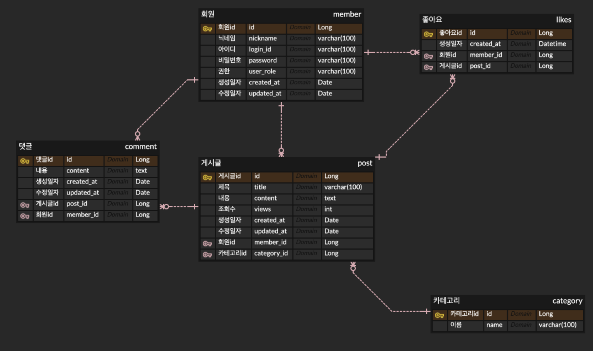

# 📝 게시판(PostProject)

## 📖 프로젝트 개요
- **이 프로젝트는 무엇인가요?**
  - 이 프로젝트는 회원가입 및 로그인 후, 자유게시판에서 게시글을 작성하거나 질문 게시판을 통해 궁금한 점을 물어볼 수 있는 커뮤니티 형태의 게시판입니다.
  - 댓글을 통해 사용자 간 의견을 공유할 수 있으며, 비회원도 게시글 및 댓글을 조회할 수 있습니다. 하지만 작성 및 삭제 권한은 회원에게만 부여됩니다.
- **왜 만들었나요?**
  - 단순한 게시판 기능 구현을 넘어, 프로젝트를 진행하면서 새롭게 적용하는 내용은 학습하고 기존에 알고 있던 내용을 복습하고, 부족한 부분을 보완하는 데 초점을 맞췄습니다.
  - 특히, **실제 운영 환경에 배포 후 발생하는 문제를 개선하고**, **쿼리 성능 최적화**, **인덱스 튜닝**, **DB 백업 및 복원** 등 **비기능적 요구사항(NFR, Non-Functional Requirements)** 을 고려하며 프로젝트를 진행하였습니다.

- **어떤 문제를 해결했나요?**

  **1. MyBatis에서 `keyProperty`가 정상적으로 인식되지 않는 문제**
  - **문제:**
    - `INSERT` 쿼리를 실행할 때, 여러 필드를 개별적으로 파라미터로 전달하면 `keyProperty="id"` 옵션이 정상적으로 동작하지 않는 문제가 발생함.
  - **해결 방법:**
    - 필드들을 개별적으로 전달하는 대신, **객체 단위로 파라미터를 전달**하는 방식이 더 안정적임.
    - MyBatis에서 `keyProperty`를 정상적으로 인식하려면 **객체로 파라미터를 전달하는 것이 권장됨**.

  **2. `created_at` 컬럼이 `NULL`로 조회되는 문제**
  - **문제:**
    - `post` 테이블에서 `created_at` 값을 조회했을 때, DB에는 데이터가 존재하지만 **Java 객체에서는 `NULL`로 반환**되는 문제가 발생함.
  - **해결 방법:**
    - `datetime` 타입이 Java의 `LocalDateTime` 필드와 정상적으로 매핑되지 않는 경우, 	**MyBatis의 `resultMap`을 사용하여 명시적으로 매핑**해야 함.
    - `resultMap`을 설정하여 Java 객체와 DB 컬럼 간 **타입 매칭을 정확히 지정**하여 해결함.


  **3. EC2 배포 후 게시글 작성이 안 되는 문제**
  - **문제:**
    - 로컬에서는 게시글 작성이 정상적으로 동작하지만, **EC2 서버에서는 `INSERT`가 실패**하는 문제가 발생함. 
  - **원인:**
    - **로컬과 EC2의 데이터베이스 문자셋(charset) 설정이 다름**.
    - **로컬 DB:** `utf8mb4`
    - **EC2 서버 DB:** `latin1` (인코딩 불일치)
  - **해결 방법:**
    - **EC2의 데이터베이스 문자셋을 `utf8mb4`로 변경**하여 로컬과 일치시킴.

  **4. GIthub Action 적용 중 실수로 ssh키를 노출한 문제**
  - **문제:**
    - GitHub Actions 설정 중 실수로 **EC2 접속용 SSH 프라이빗 키가 노출되는 실수**가 발생함.
    - 노출된 키는 누구나 EC2에 접근할 수 있는 위험이 있기 때문에 즉시 조치가 필요했음.
  - **원인:**
    - GitHub Secrets을 설정하는 과정에서 SSH 프라이빗 키를 실수로 노출함.
  - **해결 방법:**
    - 기존 SSH 키 폐기 및 새로운 키 생성
    - **AWS Systems Manager Session Manager**를 통해 EC2 서버에 접속 후, EC2 내부에서 `~/.ssh/authorized_keys` 파일을 수정하여 새로운 SSH 키 적용.


## 🚀 주요 기능
### 📝 게시판 기능
- ✅ **게시글 CRUD** (작성, 수정, 삭제, 조회)
- ✅ **카테고리 분류 및 필터링** (공지사항, 자유게시판, 질문게시판)
- ✅ **검색 기능** (게시글 제목, 내용 검색, 사용자의 닉네임 검색, 게시글의 댓글 검색)
- ✅ **좋아요 기능** (게시글에 좋아요 클릭 가능)

### 🔑 사용자 인증 및 권한
- ✅ **회원가입 및 로그인** (Spring Security 기반 세션 방식)
- ✅ **비회원 제한** (비회원은 조회만 가능, 작성 및 삭제는 불가)

### 💬 커뮤니케이션
- ✅ **댓글 기능** (작성, 수정, 삭제)

## ⚙ 기술 스택
- **Backend:** Java, Spring Boot, MyBatis
- **Frontend:** Thymeleaf, JavaScript
- **Database:** MariaDB
- **Infra:** AWS EC2
- **CI/CD:** GitHub Actions

## 🎯 ERD (데이터베이스 구조)



## 🔧 프로젝트 설정 및 실행 방법
### 1️⃣ **환경 설정**
- JDK 17+
- MariaDB 10.5+
- Gradle 8.11+
- **설정 파일 (`application.yml`) 추가 필요**

### 2️⃣ **설치 방법**
```bash
# 1️⃣ 프로젝트 클론
git clone https://github.com/your-repo/PostProject.git
cd PostProject

# 2️⃣ MariaDB 실행 확인 및 데이터베이스 설정
# MariaDB가 실행 중인지 확인 후, 실행되지 않았다면 실행
sudo systemctl start mariadb  # (Linux)
brew services start mariadb   # (Mac)

# 3️⃣ 데이터베이스 및 테이블 생성 (필요 시 변경)
mysql -u root -p -e "CREATE DATABASE post_project DEFAULT CHARACTER SET utf8mb4 COLLATE utf8mb4_unicode_ci;"

# 4️⃣ DB 스키마 및 초기 데이터 적용
mysql -u root -p post_project < src/main/resources/schema.sql
mysql -u root -p post_project < src/main/resources/data.sql  # (초기 데이터가 있는 경우)

# 5️⃣ 프로젝트 실행
./gradlew build && SPRING_PROFILES_ACTIVE=prod ./gradlew bootRun
